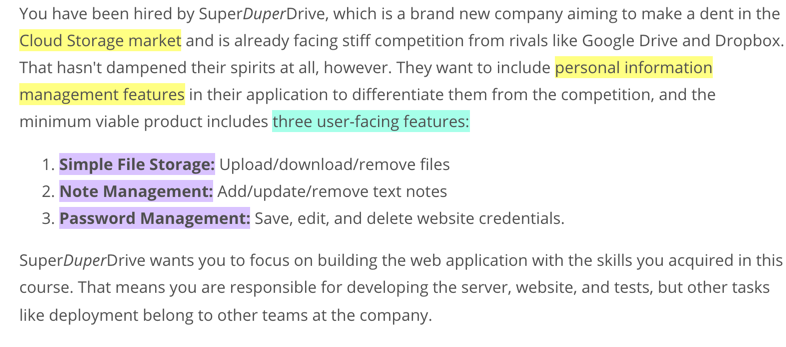
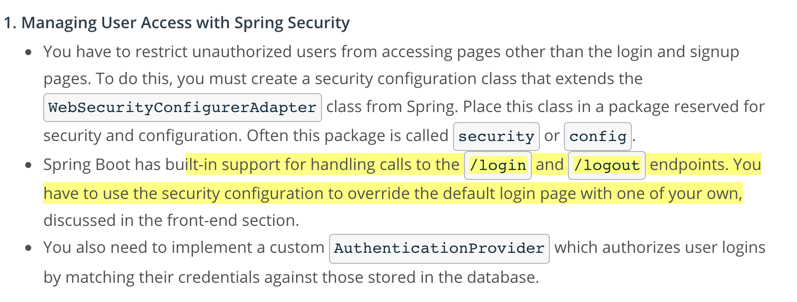
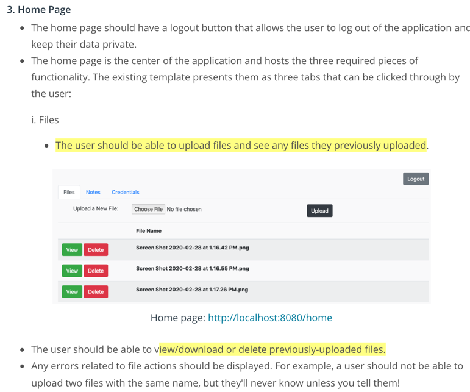
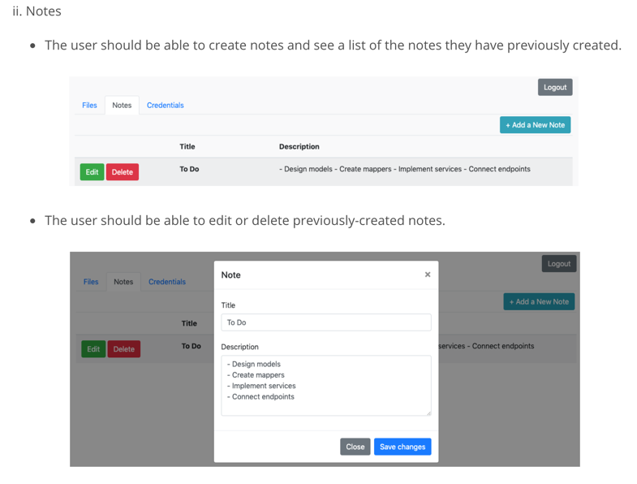
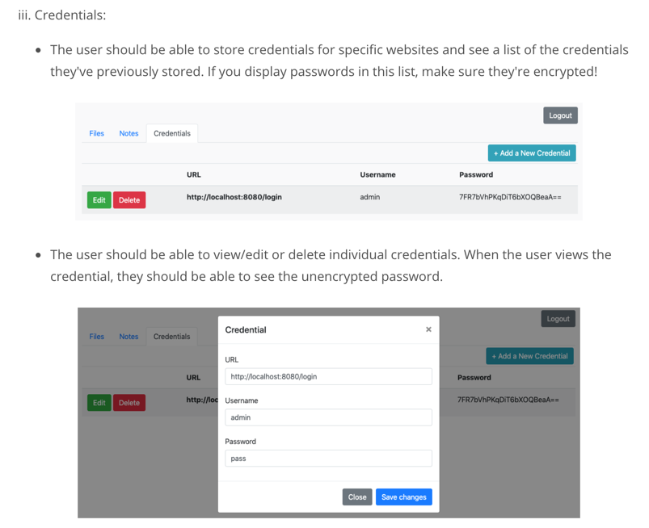
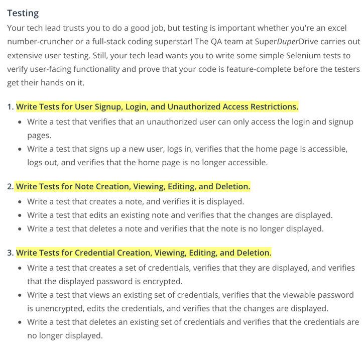

# SuperDuperDrive

# road map:
1. The back-end with Spring Boot
2. The front-end with Thymeleaf
3. Application tests with Selenium
## back-end:
### User Access:

1. manage user access with spring security
   1. create a **security configuration** class
   2. override the default **login.html page** with one of your own
   3. created MyBaits mapper for **UserMapper** and **User POJO**. 
   4. implemented **authentication service** customized authenticate method.
2. login and signup:
   1. use thymeleaf and spring security to modify the html template.(**login.html**)
   2. implemented **userService** (isUserNameAvailable, createUser, getUser)
   3. implemented **login and signup controller** which use createUser to create user and handle some register error cases
   
## Home Page
### upload, view, and delete the files

1. create file POJO: model/File; 
   create file form POJO: model/FileForm to receive the POJO that user send
2. create file mapper with MyBaits: mapper/FileMapper  
3. create services for file operations:service/FileService
4. create controller for file (homeController, fileController)
   - put the file controller out of the home controller: (separate concerns): fileController
   - use modelAttribute to create model before mapping  
      - ``@ModelAttribute("newFileForm") FileForm newFileForm``
5. change html to thymeleaf template(home.html)  
### upload, view, and delete the Notes

1. create the POJO: model/Note
   create file form POJO: model/FileForm to receive the POJO that user send
2. create file mapper with MyBaits: mapper/NoteMapper
3. create services for Note operations:service/NoteService
4. create controller for notes(NoteController)
5. change html to thymeleaf template(home.html)
### upload, view, and delete the credentials

1. create the POJO: model/Credential
   create file form POJO: model/CredentialForm to receive the POJO that user send
2. create file mapper with MyBaits: mapper/CredentialMapper

### test
